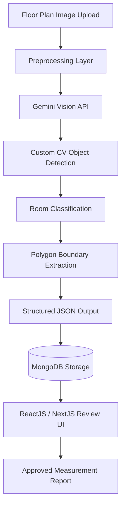

# LLM CV Floor Plan Detection

> Multimodal AI system for automated floor plan room detection and measurement using Gemini Vision and a custom computer vision model, with a full-stack web interface.

---

## Overview

This project combines a large vision-language model (Gemini) with a custom computer vision object detection pipeline to automatically analyze architectural floor plan images. The system detects individual rooms, maps their polygon boundaries, calculates dimensions, and produces structured output that feeds directly into property listing workflows.

The full stack includes a Python/NodeJS backend, MongoDB for storage, and a ReactJS/NextJS frontend for the review and export interface.

---

## System Architecture



---

## Tech Stack

| Layer | Technology |
|---|---|
| Vision LLM | Gemini Vision (multimodal) |
| Object Detection | Custom CV model (Python) |
| Backend | Python, NodeJS |
| Frontend | ReactJS, NextJS, TypeScript |
| Database | MongoDB |
| API Layer | REST API |

---

## Key Features

- **Multimodal room detection** — Gemini Vision interprets the floor plan holistically, while the CV model provides precise boundary extraction
- **Polygon coordinate mapping** — each detected room is mapped with closed polygon coordinates for area calculation
- **Room classification** — automatically labels room types (bedroom, bathroom, living room, kitchen, garage, etc.)
- **Structured JSON output** — standardized schema per room including type, area (sqm), polygon points, and confidence score
- **Human-in-loop review interface** — web UI for property managers to verify, adjust, and approve measurements before export
- **Full audit trail** — MongoDB stores every version of detection output with timestamps and reviewer actions

---

## Output Schema

```json
{
  "floor_plan_id": "fp_001",
  "rooms": [
    {
      "room_id": "r_01",
      "type": "bedroom",
      "area_sqm": 14.2,
      "polygon": [[x1,y1],[x2,y2],...],
      "confidence": 0.94
    }
  ],
  "total_area_sqm": 87.5,
  "processed_at": "2026-03-15T10:22:00Z",
  "review_status": "approved"
}
```

---

## Results

| Metric | Value |
|---|---|
| Processing time per unit | ~10 minutes (down from ~100 min) |
| Throughput increase | 3-4x |
| Measurement accuracy | ~95% with human review |
| Room type coverage | 10+ room categories |

---

## Setup

```bash
git clone https://github.com/anwarraif/LLM-CV-floorplan-detection
cd LLM-CV-floorplan-detection

# Backend
pip install -r requirements.txt
cp .env.example .env
# Set GEMINI_API_KEY, MONGODB_URI
python server.py

# Frontend
cd frontend
npm install
npm run dev
```

---

## Author

**Kurnia Anwar Ra'if** — Senior AI Engineer  
[LinkedIn](https://www.linkedin.com/in/anwaraif/) | [GitHub](https://github.com/anwarraif) | kurniaanwarraif@gmail.com
